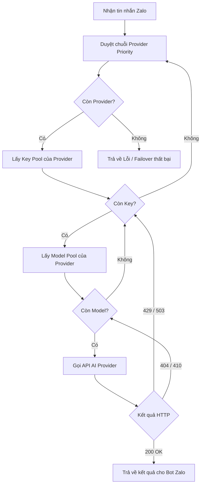

# SPEC-001: Đặc Tả Kỹ Thuật AI Failover Ma Trận 3D

## Trạng Thái: Approved

## Quy Trình Xử Lý Thuật Toán Failover (Provider -> Key -> Model)

## Các Quy Tắc Ranh Giới (Constraints & Guards)
1. **Loại bỏ Model Retired**: Không gọi các model tên cũ đã ngừng hoạt động như `gemma3:12b`, `gemini-1.5-flash`, `gemini-2.0-flash-lite-preview-02-05`.
2. **Key Masking**: Tất cả API Keys lưu trong database phải được che giấu (masked) trước khi phản hồi về giao diện Web Dashboard (`GET /api/ai/config`).
3. **Failover Success Log**: Khi tự động chuyển đổi thành công sang Provider backup, phải ghi log dạng `[AI Failover SUCCESS] Nhà cung cấp chính X bị lỗi, đã tự động chuyển đổi thành công sang Y.`
